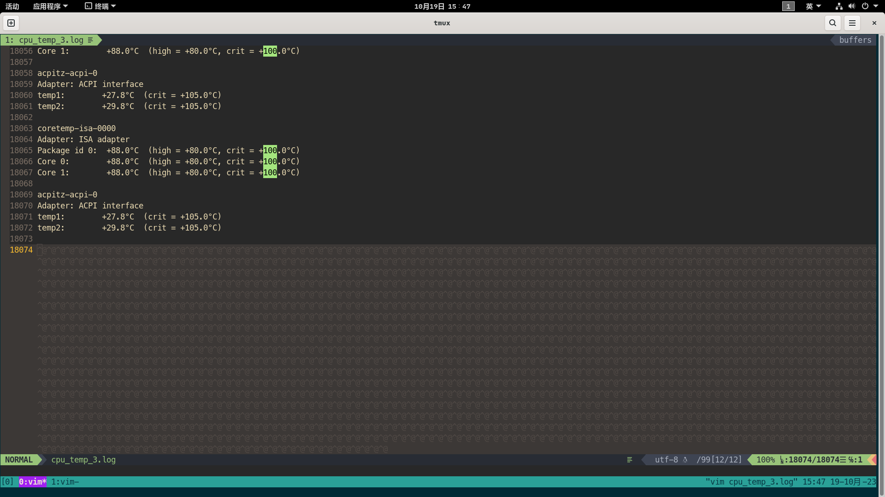
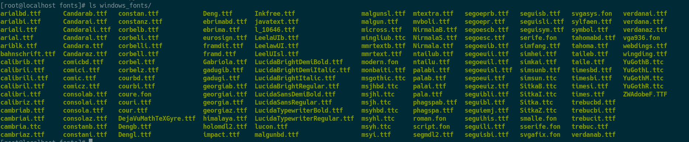

<!-- vim-markdown-toc Marked -->

* [系统备份与迁移](#系统备份与迁移)
    - [1. 备份系统](#1.-备份系统)
    - [2. 迁移](#2.-迁移)
    - [3. 遇到的问题与解决方案](#3.-遇到的问题与解决方案)
        + [问题2的具体修复流程：](#问题2的具体修复流程：)
* [解决linux中wps显示乱码的问题](#解决linux中wps显示乱码的问题)

<!-- vim-markdown-toc -->

## 系统备份与迁移

* 将计算机A上的配置、软件、开发环境迁移到计算机B
* 计算机A和计算机B系统版本一样(openEuler_2203), 计算机B状态为刚安装完系统
* 需求背景：使用的计算机A会在使用期间突然死机，一开始以为是内存不够用的原因，
    但是后来增加了内存还是一样的情况，所以猜测和系运行时的资源占用情况没关系
    (最终也没有排查到具体死机的原因)。因此想换一台设备，并希望能够不再重新配
    置环境。
    ```sh
    # 系统运行时在后台监测内存使用情况
    free -h -s 1 > free.log
    # 监测系统负载、进程运行情况
    watch -n 1 'top -b -n 1 | head -n 30 >> top_3.log'
    # 监测CPU温度
    watch -n 1 'sensors >> cpu_temp_1.log'
    # 监测io占用
    watch -n 1 'iotop -a -o -b >> iotop.log'
    ```
    * 运行期间CPU温度过高
    
    * 死机的瞬间CPU温度在可承受范围内
    
    <!--  -->
    * 死机瞬间top显示没有异常进程
    
    <!--  -->
    <!--  -->


### 1. 备份系统
```sh
# 备份/etc/ /usr/ /opt/ /root/.vimrc /home/lc/目录 并且排除掉/etc/fstab文件,
# 最后的home目录和/root/.vimrc视自己的实际情况选择
tar czpvf system_2023_10_25.tar.gz --exclude-caches --exclude /etc/fstab --exclude /etc/mtab \
--exclude /etc/passwd --exclude /etc/shadow --exclude /etc/group --exclude /etc/security \
--exclude /home/lc/system_2023_10_25.tar.gz /etc/ /usr/ /opt/ /root/.vimrc /home/lc
```
**排除/etc/fstab文件是因为, 两台计算机物理配置不一样, 如果直接拷贝这个文件会导致文件系统破环**
(我第一次就是这样操作, 迁移完重启系统后自动进入了紧急救援模式, 虽然也可以修复但是比较麻烦, 比较浪费时间)

### 2. 迁移
* 解压前:
```sh
# 解压前给新的系统安装了gnome桌面、ibus输入法和实时系统补丁
dnf install gnome*
dnf install ibus*
systemctl set-default graphical.target
systemctl enable gdm
dnf install kernel-rt
```

* 解压:
```sh
# 将system.tar.gz 解压到计算机B的根目录
tar xzpvf system.tar.gz -C /
```

* 解压后(此处比较重要):
```sh
# 更新系统字体库缓存
fc-cache
# 解压完后的操作
source /etc/profile # 环境变量是否异常
# 建议此时修改开启启动的配置, 否则可能会遇到后面提到的登陆死循环问题
将 /etc/selinux/config 文件中的 'SELINUX=enforcing' 修改为 'SELINUX=disabled'
```

### 3. 遇到的问题与解决方案
* 问题1：在备份时没有排除/etc/fstab文件导致系统重启直接进入紧急救援模式
* 解决方案：在救援模式下重新设置并挂载分区。

系统自动进入的救援模式下，无法正常进入bash操作，因次用U盘启动项进入救援模式。
由于此方法修复比较麻烦又比较浪费时间(不如重装系统，重新迁移需要的时间少，而且更简单)。

* 问题2：在重装系统，重新执行了迁移的操作重启系统之后，无法正常登陆，
    进入登陆死循环(不管是从界面登陆还是命令行登陆)。
* 解决方案：此现象可能是环境变量异常引起，但是在解压完之后检查了环
    境变量没有报错。用关闭SELinux的方案修复成功。

#### 问题2的具体修复流程：
* a. 重启系统并进入单列模式

进入单列模式的方法参考链接: <https://www.linuxidc.com/Linux/2017-04/142475.htm>


* b. 进入单列模式之后修改文件系统为可读可写
```sh
# 在单列模式中如果文件系统为只读，则用下面的命令进行修改
mount -o remount, rw /
```

* c. 关闭SELinux
```sh
将 /etc/selinux/config 文件中的 'SELINUX=enforcing' 修改为 'SELINUX=disabled'
```


* d. 保存修改并重启

**迁移完开机之后，检查系统正常。检查计算机A上面安装的软件在计算机B上也有了，并且都可以正常使用，
甚至在计算机B上启动浏览器，自动打开了备份系统时计算机A上浏览器打开的标签页， 检查开发环境正常。**

**在备份迁可以正常使用的情况下，此种方案也可以用来做系统的备份与还原(相当于系统快照)。**

## 解决linux中wps显示乱码的问题

* 安装了wps弹窗提示的字体还是无法正常显示


* 将windows系统中的字体安装到linux后wps正常显示



